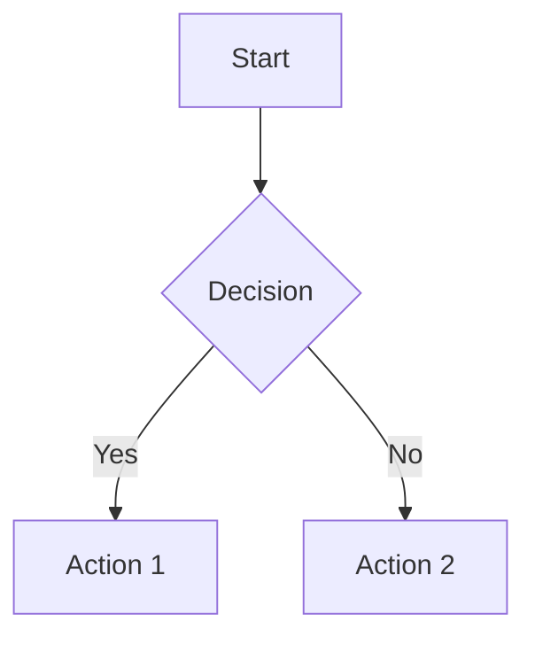

# MkDocs Documentation Guide

This guide explains how to build, serve, and deploy the Multi-Modal Academic Research System documentation using MkDocs with Material theme.

## 📋 Prerequisites

- Python 3.9 or higher
- pip package manager
- Git (for deployment to GitHub Pages)

## 🚀 Quick Start

### 1. Install Dependencies

```bash
# Install MkDocs and Material theme
pip install -r requirements.txt

# Or install just documentation dependencies
pip install mkdocs==1.5.3 mkdocs-material==9.5.3 mkdocs-material-extensions==1.3.1 pymdown-extensions==10.7
```

### 2. Serve Documentation Locally

```bash
# From project root
mkdocs serve

# Documentation will be available at http://127.0.0.1:8000
```

The development server includes:
- **Live reload** - Changes automatically reflected
- **Search** - Full-text search functionality
- **Navigation** - Interactive table of contents

### 3. Build Static Site

```bash
# Build documentation to site/ directory
mkdocs build

# Build with strict mode (fails on warnings)
mkdocs build --strict

# Clean build (remove site/ directory first)
mkdocs build --clean
```

## 🎨 Customization

### Theme Configuration

Edit `mkdocs.yml` to customize:

```yaml
theme:
  name: material
  palette:
    - scheme: default
      primary: indigo
      accent: indigo
  features:
    - navigation.tabs
    - navigation.instant
    - search.suggest
```

### Adding Custom CSS

1. Create CSS file in `docs/stylesheets/`:
```css
/* docs/stylesheets/custom.css */
.custom-class {
  color: #ff0000;
}
```

2. Reference in `mkdocs.yml`:
```yaml
extra_css:
  - stylesheets/custom.css
```

### Adding Custom JavaScript

1. Create JS file in `docs/javascripts/`:
```javascript
// docs/javascripts/custom.js
console.log('Custom script loaded');
```

2. Reference in `mkdocs.yml`:
```yaml
extra_javascript:
  - javascripts/custom.js
```

## 📚 Writing Documentation

### Markdown Features

MkDocs Material supports extended Markdown syntax:

#### Admonitions

```markdown
!!! note "Optional Title"
    This is a note admonition.

!!! tip
    This is a tip without a custom title.

!!! warning "Caution"
    This is a warning.

??? question "Collapsible Question"
    This admonition starts collapsed.
```

#### Code Blocks with Syntax Highlighting

````markdown
```python
def hello_world():
    print("Hello, World!")
```

```bash
# Commands with highlighting
cd /path/to/directory
ls -la
```
````

#### Tabs

```markdown
=== "Python"

    ```python
    print("Hello from Python")
    ```

=== "JavaScript"

    ```javascript
    console.log("Hello from JavaScript");
    ```
```

#### Mermaid Diagrams

````markdown

````

#### Task Lists

```markdown
- [x] Completed task
- [ ] Incomplete task
- [ ] Another task
```

#### Emoji

```markdown
:smile: :rocket: :tada:
```

## 📁 File Organization

```
project/
├── mkdocs.yml              # Main configuration
├── docs/                   # Documentation source
│   ├── index.md            # Home page
│   ├── setup/              # Setup guides
│   ├── tutorials/          # Tutorials
│   ├── api/                # API reference
│   ├── stylesheets/        # Custom CSS
│   ├── javascripts/        # Custom JS
│   └── assets/             # Images, files
└── site/                   # Built site (generated)
```

## 🔧 Navigation Structure

Edit navigation in `mkdocs.yml`:

```yaml
nav:
  - Home: index.md
  - Getting Started:
      - Installation: setup/installation.md
      - Quick Start: setup/quick-start.md
  - Tutorials:
      - Tutorial 1: tutorials/tutorial1.md
      - Tutorial 2: tutorials/tutorial2.md
```

## 🚢 Deployment Options

### Option 1: GitHub Pages

#### Automatic Deployment

```bash
# Deploy to GitHub Pages
mkdocs gh-deploy

# With custom commit message
mkdocs gh-deploy -m "Update documentation"
```

This command:
1. Builds the documentation
2. Pushes to `gh-pages` branch
3. GitHub Pages automatically serves the site

#### Manual Deployment

```bash
# Build the site
mkdocs build

# Commit and push site/ directory
git add site/
git commit -m "Update docs"
git push origin gh-pages
```

#### GitHub Actions

Create `.github/workflows/docs.yml`:

```yaml
name: Deploy Documentation

on:
  push:
    branches: [main]

jobs:
  deploy:
    runs-on: ubuntu-latest
    steps:
      - uses: actions/checkout@v3

      - name: Setup Python
        uses: actions/setup-python@v4
        with:
          python-version: '3.9'

      - name: Install dependencies
        run: |
          pip install mkdocs-material

      - name: Deploy
        run: mkdocs gh-deploy --force
```

### Option 2: Netlify

1. Connect GitHub repository to Netlify
2. Configure build settings:
   - Build command: `mkdocs build`
   - Publish directory: `site`
3. Deploy

### Option 3: Docker

Create `Dockerfile.docs`:

```dockerfile
FROM python:3.9-slim

WORKDIR /docs

COPY requirements.txt .
RUN pip install --no-cache-dir -r requirements.txt

COPY . .

EXPOSE 8000

CMD ["mkdocs", "serve", "--dev-addr=0.0.0.0:8000"]
```

Build and run:

```bash
# Build image
docker build -t docs -f Dockerfile.docs .

# Run container
docker run -p 8000:8000 docs
```

### Option 4: ReadTheDocs

1. Create `.readthedocs.yml`:

```yaml
version: 2

mkdocs:
  configuration: mkdocs.yml

python:
  version: "3.9"
  install:
    - requirements: requirements.txt
```

2. Connect repository to ReadTheDocs
3. Documentation builds automatically

## 🔍 Search Configuration

### Built-in Search

Enabled by default in `mkdocs.yml`:

```yaml
plugins:
  - search:
      separator: '[\s\-,:!=\[\]()"/]+|\.(?!\d)|&[lg]t;'
      lang:
        - en
```

### Advanced Search Options

```yaml
plugins:
  - search:
      separator: '[\s\-,:!=\[\]()"/]+|\.(?!\d)|&[lg]t;'
      lang:
        - en
        - es  # Multiple languages
      prebuild_index: true  # Faster search
```

## 📊 Analytics

### Google Analytics

Add to `mkdocs.yml`:

```yaml
extra:
  analytics:
    provider: google
    property: G-XXXXXXXXXX
```

### Custom Analytics

Add tracking code in `docs/javascripts/analytics.js`:

```javascript
// Custom analytics tracking
window.addEventListener('load', function() {
  // Your tracking code here
});
```

## 🎨 Theming

### Color Schemes

```yaml
theme:
  palette:
    # Light mode
    - media: "(prefers-color-scheme: light)"
      scheme: default
      primary: indigo
      accent: pink
      toggle:
        icon: material/brightness-7
        name: Switch to dark mode

    # Dark mode
    - media: "(prefers-color-scheme: dark)"
      scheme: slate
      primary: indigo
      accent: pink
      toggle:
        icon: material/brightness-4
        name: Switch to light mode
```

### Logo and Favicon

```yaml
theme:
  logo: assets/logo.png
  favicon: assets/favicon.png
```

## 🔧 Plugins

### Essential Plugins

Already configured in `mkdocs.yml`:

- **search** - Full-text search
- **minify** - HTML/CSS/JS minification
- **git-revision-date-localized** - Show last update dates
- **tags** - Tag-based navigation

### Additional Useful Plugins

```bash
# Install additional plugins
pip install mkdocs-awesome-pages-plugin
pip install mkdocs-macros-plugin
pip install mkdocs-redirects
```

Add to `mkdocs.yml`:

```yaml
plugins:
  - awesome-pages
  - macros
  - redirects:
      redirect_maps:
        'old-page.md': 'new-page.md'
```

## 🐛 Troubleshooting

### Build Warnings

```bash
# View warnings in detail
mkdocs build --strict --verbose

# Common issues:
# - Broken links: Fix internal links
# - Missing pages: Add to nav or create file
# - Invalid YAML: Check mkdocs.yml syntax
```

### Serve Issues

```bash
# Port already in use
mkdocs serve --dev-addr=127.0.0.1:8001

# Permission denied
sudo mkdocs serve
```

### Deployment Issues

```bash
# GitHub Pages not updating
# 1. Check gh-pages branch exists
git branch -a

# 2. Force rebuild
mkdocs gh-deploy --force

# 3. Check GitHub Pages settings
```

## 📝 Best Practices

### 1. File Organization

```
docs/
├── index.md              # Landing page
├── getting-started/      # Tutorial content
├── guides/               # How-to guides
├── reference/            # API reference
└── explanations/         # Conceptual docs
```

### 2. Naming Conventions

- Use lowercase with hyphens: `my-page.md`
- Avoid spaces and special characters
- Keep filenames descriptive but concise

### 3. Internal Links

```markdown
# Relative links
[Link to page](../other-page.md)

# Anchor links
[Link to section](#section-heading)

# Cross-references
[API Reference](reference/api.md#specific-function)
```

### 4. Images

```markdown
# With caption

*Figure 1: Screenshot of the UI*

# With sizing
{ width="300" }
```

### 5. Code Examples

````markdown
# With title and line numbers
```python title="example.py" linenums="1"
def example():
    return "Hello"
```

# With highlighting
```python hl_lines="2 3"
def example():
    # This line is highlighted
    # This line is highlighted
    return "Hello"
```
````

## 🔄 Version Control

### .gitignore

Add to `.gitignore`:

```
# MkDocs
site/
.cache/

# Python
__pycache__/
*.pyc
venv/
```

### Commit Messages

```bash
# Good commit messages
git commit -m "docs: Add API reference for collectors"
git commit -m "docs: Update installation guide with Docker"
git commit -m "docs: Fix broken links in tutorials"
```

## 📚 Resources

### Official Documentation

- [MkDocs](https://www.mkdocs.org/)
- [Material for MkDocs](https://squidfunk.github.io/mkdocs-material/)
- [PyMdown Extensions](https://facelessuser.github.io/pymdown-extensions/)

### Community

- [MkDocs Discussion](https://github.com/mkdocs/mkdocs/discussions)
- [Material Theme Discussion](https://github.com/squidfunk/mkdocs-material/discussions)

### Examples

- [Material Theme Showcase](https://squidfunk.github.io/mkdocs-material/reference/)
- [MkDocs Examples](https://github.com/mkdocs/mkdocs/wiki/MkDocs-Themes)

## 🎯 Quick Commands Reference

```bash
# Development
mkdocs serve              # Start dev server
mkdocs serve --strict     # With strict mode
mkdocs build              # Build site
mkdocs build --clean      # Clean build

# Deployment
mkdocs gh-deploy          # Deploy to GitHub Pages
mkdocs gh-deploy --force  # Force deploy

# Other
mkdocs new project-name   # Create new project
mkdocs --version          # Check version
mkdocs --help             # Show help
```

## 📊 Performance Tips

1. **Optimize Images**
   - Compress images before adding
   - Use appropriate formats (WebP, PNG, JPG)
   - Resize to appropriate dimensions

2. **Minimize Custom Code**
   - Keep custom CSS/JS minimal
   - Use built-in features when possible

3. **Enable Caching**
   - Use browser caching
   - Enable CDN for assets

4. **Lazy Loading**
   - Defer non-critical scripts
   - Lazy load images when possible

---

**Need Help?**

- Check [MkDocs Material Documentation](https://squidfunk.github.io/mkdocs-material/)
- Visit [GitHub Discussions](https://github.com/squidfunk/mkdocs-material/discussions)
- Review [Examples and Tutorials](https://github.com/mkdocs/mkdocs/wiki)
