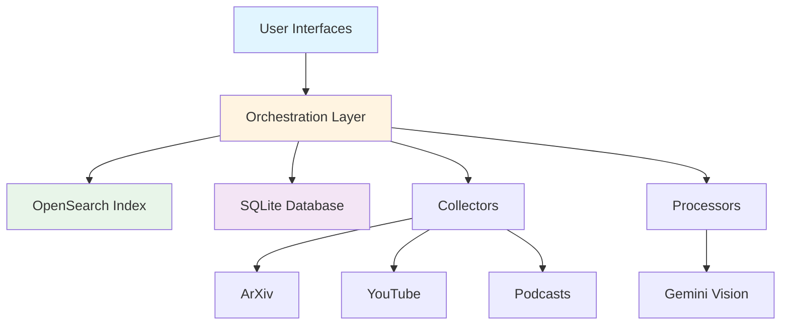

# Multi-Modal Academic Research System

<div align="center">


**A comprehensive Python application for collecting, processing, and querying academic content from multiple sources using RAG (Retrieval-Augmented Generation) with OpenSearch and Google Gemini.**

[Get Started](setup/quick-start.md){ .md-button .md-button--primary }
[View on GitHub](https://github.com/yourusername/multi-modal-academic-research-system){ .md-button }

</div>

---

## 🎯 What is This?

The Multi-Modal Academic Research System is a sophisticated platform that enables researchers, students, and professionals to:

- **📚 Collect** academic papers from ArXiv, PubMed Central, and Semantic Scholar
- **🔬 Process** PDFs with text extraction and AI-powered diagram analysis
- **🔍 Index** content using hybrid search (keyword + semantic) with OpenSearch
- **💬 Query** your knowledge base with natural language using Google Gemini
- **📊 Track** citations automatically with bibliography export (BibTeX, APA)
- **📈 Visualize** your collection with interactive dashboards

## ✨ Key Features

<div class="grid cards" markdown>

-   :material-file-document-multiple:{ .lg .middle } __Multi-Source Collection__

    ---

    Collect from ArXiv, PubMed, Semantic Scholar, YouTube, and podcasts

    [:octicons-arrow-right-24: Learn more](modules/data-collectors.md)

-   :material-robot:{ .lg .middle } __AI-Powered Processing__

    ---

    Gemini Vision for diagram analysis and content understanding

    [:octicons-arrow-right-24: Learn more](modules/data-processors.md)

-   :material-magnify:{ .lg .middle } __Hybrid Search__

    ---

    BM25 + semantic vector search for optimal relevance

    [:octicons-arrow-right-24: Learn more](modules/indexing.md)

-   :material-format-quote-close:{ .lg .middle } __Citation Tracking__

    ---

    Automatic extraction and bibliography export

    [:octicons-arrow-right-24: Learn more](modules/orchestration.md)

-   :material-web:{ .lg .middle } __Interactive UI__

    ---

    Gradio web interface + FastAPI REST API

    [:octicons-arrow-right-24: Learn more](modules/ui.md)

-   :material-chart-line:{ .lg .middle } __Data Visualization__

    ---

    Real-time statistics and analytics dashboard

    [:octicons-arrow-right-24: Learn more](tutorials/visualization.md)

</div>

## 🚀 Quick Start

Get up and running in 5 minutes:

```bash
# 1. Clone and setup
git clone https://github.com/yourusername/multi-modal-academic-research-system.git
cd multi-modal-academic-research-system
python -m venv venv && source venv/bin/activate

# 2. Install dependencies
pip install -r requirements.txt

# 3. Configure environment
cp .env.example .env
# Edit .env and add your GEMINI_API_KEY

# 4. Start OpenSearch
docker run -p 9200:9200 -e "discovery.type=single-node" opensearchproject/opensearch:latest

# 5. Run the application
python main.py
```

!!! success "Ready!"
    The Gradio UI will open at [http://localhost:7860](http://localhost:7860)

[:material-rocket-launch: Detailed Installation Guide](setup/installation.md){ .md-button }

## 📖 Documentation Structure

This documentation is organized into several sections:

=== "Getting Started"

    - **[Installation](setup/installation.md)** - Complete setup instructions
    - **[Quick Start](setup/quick-start.md)** - Get running in 5 minutes
    - **[Configuration](setup/configuration.md)** - Environment and settings

=== "Core Concepts"

    - **[Architecture](architecture/overview.md)** - System design
    - **[Data Flow](architecture/data-flow.md)** - How data moves
    - **[Technology Stack](architecture/technology-stack.md)** - Technologies used

=== "User Guides"

    - **[Collecting Papers](tutorials/collect-papers.md)** - Step-by-step collection
    - **[Custom Searches](tutorials/custom-searches.md)** - Advanced queries
    - **[Export Citations](tutorials/export-citations.md)** - Bibliography management

=== "Reference"

    - **[Module API](modules/data-collectors.md)** - Complete API reference
    - **[REST API](api/rest-api.md)** - HTTP endpoints
    - **[Database Schema](database/schema.md)** - SQLite structure

## 🏗️ Architecture



[:material-sitemap: Detailed Architecture](architecture/overview.md){ .md-button }

## 💻 Code Example

```python
from multi_modal_rag.data_collectors import AcademicPaperCollector
from multi_modal_rag.indexing import OpenSearchManager
from multi_modal_rag.orchestration import ResearchOrchestrator

# Collect papers
collector = AcademicPaperCollector()
papers = collector.collect_arxiv_papers("machine learning", max_results=10)

# Index papers
opensearch = OpenSearchManager()
for paper in papers:
    opensearch.index_document("research_assistant", {
        'content_type': 'paper',
        'title': paper['title'],
        'abstract': paper['abstract'],
        'authors': paper['authors']
    })

# Query system
orchestrator = ResearchOrchestrator("your-gemini-api-key", opensearch)
result = orchestrator.process_query(
    "What is retrieval-augmented generation?",
    "research_assistant"
)

print(result['answer'])
print(result['citations'])
```

[:material-code-braces: More Examples](tutorials/collect-papers.md){ .md-button }

## 🛠️ Technology Stack

<div class="grid" markdown>

=== "Core"

    - **Python 3.9+** - Main language
    - **OpenSearch** - Search & vector DB
    - **Google Gemini** - AI generation
    - **SQLite** - Metadata tracking

=== "AI/ML"

    - **LangChain** - AI orchestration
    - **SentenceTransformers** - Embeddings
    - **Gemini Vision** - Image analysis
    - **Whisper** - Audio transcription

=== "Web"

    - **FastAPI** - REST API
    - **Gradio** - Web UI
    - **Uvicorn** - ASGI server
    - **Material UI** - Documentation

=== "Data"

    - **PyMuPDF** - PDF processing
    - **yt-dlp** - YouTube extraction
    - **arxiv** - ArXiv API
    - **feedparser** - RSS feeds

</div>

[:material-stack-overflow: Full Stack Details](architecture/technology-stack.md){ .md-button }

## 📊 Project Stats

<div class="grid cards" markdown>

-   **3,000+**

    ---

    Lines of Python code

-   **40+**

    ---

    Documentation files

-   **31,000+**

    ---

    Lines of documentation

-   **250+**

    ---

    Code examples

</div>

## 🎓 Learning Paths

Choose your path based on your role:

!!! tip "For Researchers"
    1. [Quick Start](setup/quick-start.md)
    2. [Collecting Papers](tutorials/collect-papers.md)
    3. [Citation Management](tutorials/export-citations.md)

!!! info "For Developers"
    1. [Architecture Overview](architecture/overview.md)
    2. [Module Documentation](modules/data-collectors.md)
    3. [API Reference](api/rest-api.md)

!!! abstract "For DevOps"
    1. [Local Deployment](deployment/local.md)
    2. [Docker Setup](deployment/docker.md)
    3. [Production Guide](deployment/production.md)

## 🐛 Common Issues

Having trouble? Check these first:

??? question "OpenSearch won't connect"

    ```bash
    # Check if OpenSearch is running
    curl -X GET "localhost:9200"

    # Restart OpenSearch
    docker restart opensearch
    ```

    [Full OpenSearch troubleshooting →](troubleshooting/opensearch.md)

??? question "Gemini API errors"

    - Verify API key in `.env`
    - Check rate limits
    - Ensure internet connection

    [API troubleshooting guide →](troubleshooting/api-errors.md)

??? question "Import errors"

    ```bash
    # Reinstall dependencies
    pip install -r requirements.txt --force-reinstall
    ```

    [Common issues →](troubleshooting/common-issues.md)

[:material-bug: Full Troubleshooting Guide](troubleshooting/common-issues.md){ .md-button }

## 🤝 Contributing

We welcome contributions! Here's how to get started:

1. Fork the repository
2. Create a feature branch
3. Make your changes
4. Submit a pull request

[:material-source-pull: Contributing Guide](https://github.com/yourusername/multi-modal-academic-research-system/blob/main/CONTRIBUTING.md){ .md-button }

## 📝 License

This project is licensed under the MIT License.

## 🙏 Acknowledgments

- **OpenSearch** - Powerful search and analytics
- **LangChain** - AI orchestration framework
- **Google Gemini** - Advanced AI capabilities
- **ArXiv** - Open-access scientific papers

---

<div align="center">

**Made with ❤️ for the research community**

[Get Started](setup/quick-start.md){ .md-button .md-button--primary }
[View Documentation](README.md){ .md-button }

</div>
